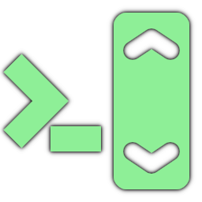
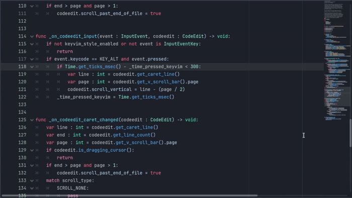
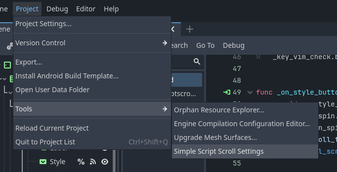

#  SimpleScriptScroll

A plugin for Godot 4. Change the scrolling behavior of the script editor.

* 

## Settings

You can change the plugin settings by choosing Project -> Tools -> "Simple Script Scroll Settings" in the main menu.
* 
